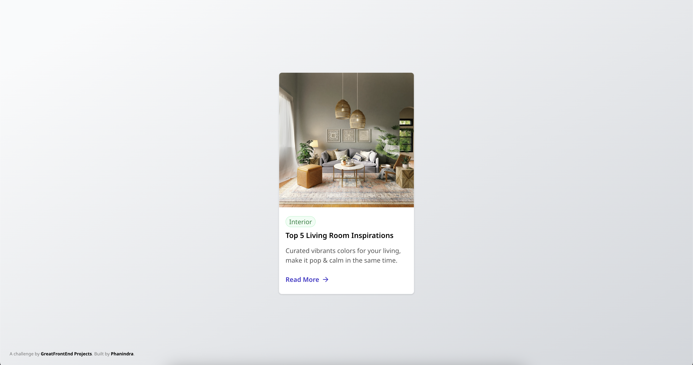
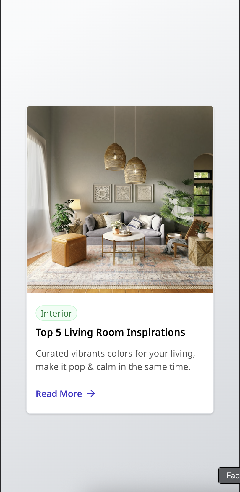

# Billing History Section
This is a solution to the [Billing History Section](https://www.greatfrontend.com/projects/challenges/billing-history-section) challenge on Great Frontend. Great Frontend challenges help you improve your coding skills by building realistic projects.

- [Overview](#overview)
    - [The challenge](#the-challenge)
    - [Screenshot](#screenshot)
    - [Links](#links)
    - [Built with](#built-with)
- [Author](#author)

# Overview
## The Challenge
In this challenge, you are tasked with creating a user interface according to the specific layouts provided for desktop, tablet, and mobile views.
## Screenshot
### Desktop:

### Mobile:

## Links

## Built With
- HTML
- CSS
- Javascript
- Typescript
- React
- Vite Config
- Tailwind Classes

## Author

- Github - [phanindra28](https://github.com/phanindra28)
- Great Frontend - [phanindra](https://www.greatfrontend.com/projects/u/phanindra)